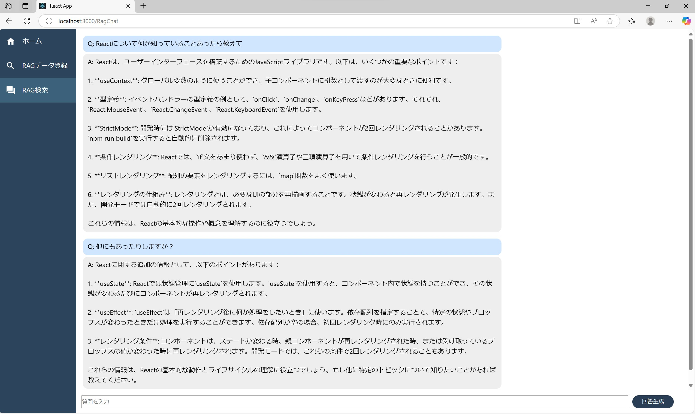
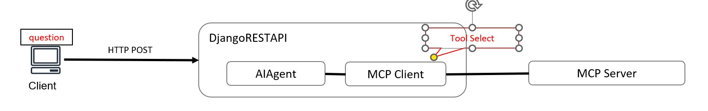

# 概要

・Rag のバックエンドスクラッチ開発。  
・Notion にたまっているナレッジをローカル RAG で参照できるようにする  
・Notion にたまっているナレッジをローカル MCP で参照できるようにする

フロントエンドは下記リポジトリ  
https://github.com/takuya-fukuda/rag-ui



# MCP の課題

MCP クライアントが Claude や Cursor 前提で作成されており、自身のアプリケーション自体に実装が困難。
そのため LangChain の MCP アダプターを使用して、自身のアプリケーションで使用できるように改良していく。  
https://qiita.com/tinymouse/items/2e22b655d8ba5fe6f3b3



# PaperWithCode トレンド

下記の PDF 解析の Git を使用すれば、構造化され、RAG の検索精度も上がりそうである。
https://github.com/bytedance/dolphin

# 技術スタック

Djnago で実装。フロントエンドは React または Next.js、バックエンドは Django の API で実装。  
LangChain を使用。

# API アプリケーションルート

| アプリルート          | 概要説明                               |
| --------------------- | -------------------------------------- |
| /api/rag/normalchat   | 通常のオフラインチャット。RAG ではない |
| /api/rag/ragchat      | 通常の RAG でのチャット。今後拡張      |
| /api/rag/dataregister | RAG のデータ登録用                     |
| /api/rag/mcp          | mcp 経由での情報参照                   |

# API 使い方

下記で起動し、URL アクセスすると Django の標準機能で API を叩ける。

```
python -m venv venv
cd venv
git clone https://github.com/takuya-fukuda/rag-research.git
cd rag-research
pip install -r requirements.txt
python manage.py runserver --settings config.settings.development
```

データを登録するときは、Django の標準機能でファイルをポストできないため、Postman から実行

# Django を初期から設定する場合の手順（初学者向け）

## カレントディレクトリで Django プロジェクト開始

```
django-admin startproject config .
```

## Git の管理からソース以外のファイルを外す

下記 Linux ベースだが Windows の VSCode の場合は、普通にファイル作成ボタンでやらないと Unicode のエラーで反映されない

```
echo '__pycache__/' >.gitignore
```

## Django の設定（開発環境、検証環境、本番環境）


共通となる設定は base.py に記載し、各環境ごとの設定ファイルで読み込む。

```
mkdir config/settings
mv config/settings.py config/settings/base.py
echo 'from .base import *' >config/settings/development.py
```

注意 echo で追記すると「UTF-8」で保存にならないせいで、「SyntaxError: source code string cannot contain null bytes」エラーが出る
VSCode 等で作成している場合は、普通にファイルを作成すればよい。
development.py の記述

```
python manage.py runserver --settings config.settings.development
```

## アプリケーションの作成

Django で用意されているアプリ作成コマンドがあるので、そちらで作成する

```
mkdir api
cd api
django-admin startapp rag
```

共通設定ファイル base.py に rest_framework 追記

```
INSTALLED_APPS = [
    'django.contrib.admin',
    'django.contrib.auth',
    'django.contrib.contenttypes',
    'django.contrib.sessions',
    'django.contrib.messages',
    'django.contrib.staticfiles',
    'rest_framework',
]
```

urls.py を使ってアプリを登録し、進めていくと app の登録が必要なので、下記 name を rag から api.rag として追記

```
class RagConfig(AppConfig):
    default_auto_field = 'django.db.models.BigAutoField'
    name = 'api.rag'
```

作成したアプリは下記のように base.py に apps.py の内容登録しておかないと認識しない

```
INSTALLED_APPS = [
    'django.contrib.admin',
    'django.contrib.auth',
    'django.contrib.contenttypes',
    'django.contrib.sessions',
    'django.contrib.messages',
    'django.contrib.staticfiles',
    'rest_framework',
    'api.rag.apps.RagConfig'
]
```

## DB セットアップ

Posgre のインストール

```
https://www.postgresql.org/download/windows/
https://qiita.com/tom-sato/items/037b8f8cb4b326710f71
```

以降 Posgre で DB を作成しておく。（CLI でもいいが Pgadmin が楽。）

windows の Posgre に pgvector を入れる方法

```
https://qiita.com/sana_bungal/items/13366afb14ee1ebafff8
```

作成した DB にログインし、PgVector を使えるようにしておく

```
CREATE EXTENSION vector;
```

DB 構成

```
python manage.py makemigrations --settings config.settings.development rag
```

migrate するがエラーが出るので、マイグレーションファイルにあらかじめ以下 2 行追加

```
from pgvector.django import VectorExtension # 追加

class Migration(migrations.Migration):
    operations = [
        VectorExtension(), # 追加
        migrations.CreateModel()
    ]
```

migrate する

```
python manage.py migrate --settings config.settings.development
```

OK が出れば終わり

## Serializers.py の定義について

シェルで入ってみる

```
python manage.py shell --settings config.settings.development
```

下記 DB 操作クエリを実行すると扱いにくいデータ構造になっているのが分かる。
このままでは扱いにくく、開発者が読める形式では返ってこない。
Serializer を使用することが Django の REST フレームワークでは一般的。

```
from api.rag.models import DataTable
queryset = DataTable.objects.all()
queryset
```

以下でクエリを実行すると見やすいデータで返ってくる
下記全データ返ってくるので注意

```
from api.rag.serializers import DataTableSerializer
serializer = DataTableSerializer(queryset, many=True)
serializer.data
```

## SuperUser の作成方法

```
python manage.py createsuperuser --username=fukuda_takuya --email=takuya-fukuda@outlook.jp --settings config.settings.development
```

スーパユーザを使って DB を操作したい場合
admin.py にテーブル情報を追記する

```
from .models import DataTable

# Register your models here.
admin.site.register(DataTable)
```
