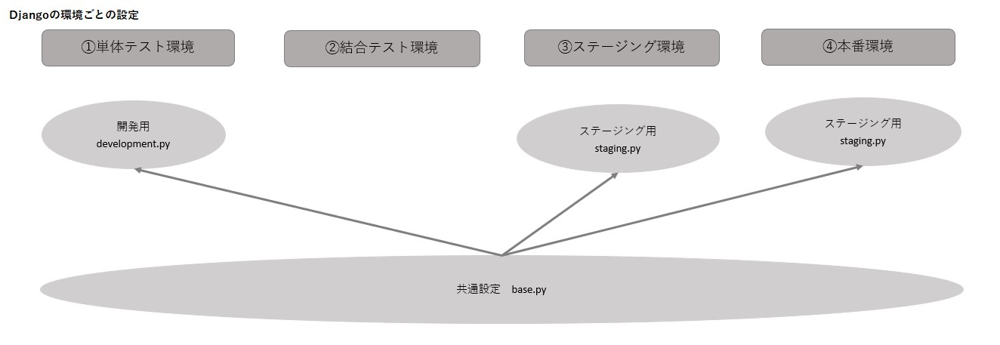

# 概要

Rag のバックエンドスクラッチ開発

# 手順

## カレントディレクトリで Django プロジェクト開始

```
django-admin startproject config .
```

## Git の管理からソース以外のファイルを外す

下記 Linux ベースだが Windows の VSCode の場合は、普通にファイル作成ボタンでやらないと Unicode のエラーで反映されない

```
echo '__pycache__/' >.gitignore
```

## Django の設定（開発環境、検証環境、本番環境）



共通となる設定は base.py に記載し、各環境ごとの設定ファイルで読み込む。

```
mkdir config/settings
mv config/settings.py config/settings/base.py
echo 'from .base import *' >config/settings/development.py
```

注意 echo で追記すると「UTF-8」で保存にならないせいで、「SyntaxError: source code string cannot contain null bytes」エラーが出る
VSCode 等で作成している場合は、普通にファイルを作成すればよい。
development.py の記述

```
python manage.py runserver --settings config.settings.development
```

## アプリケーションの作成

Django で用意されているアプリ作成コマンドがあるので、そちらで作成する

```
mkdir api
cd api
django-admin startapp rag
```

共通設定ファイル base.py に rest_framework 追記

```
INSTALLED_APPS = [
    'django.contrib.admin',
    'django.contrib.auth',
    'django.contrib.contenttypes',
    'django.contrib.sessions',
    'django.contrib.messages',
    'django.contrib.staticfiles',
    'rest_framework',
]
```
